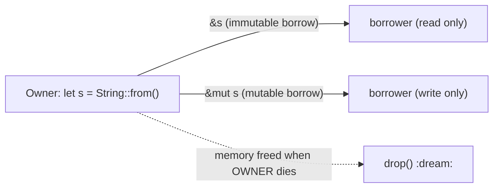

# The Ownership Problem — Explained with Diagrams

This document explains *why* Rust has ownership, using diagrams of the
"problem" it solves: memory bugs in languages without it.

---

## 1. The Core Problem: Who frees the memory?

In C/C++ you call `free()` manually. The programmer must remember
*exactly* when memory can be freed. Mistakes create three classic bugs:

| Bug | What happens | Rust's answer |
|-----|--------------|---------------|
| **Use-after-free** | Read memory after it was freed | Compile error: value moved / dropped |
| **Double-free** | Free the same memory twice | Compile error: only one owner, freed once |
| **Memory leak / dangling ptr** | Never freed / pointer to freed region | Owner drops automatically at scope end |

Other languages "solve" this with a **garbage collector (GC)** — but that
costs CPU time and pauses. Rust's answer: **ownership rules enforced at
compile time**. Zero runtime cost.

---

## 2. Diagram: Memory without ownership (the bug-factory)

```
                        THE PROBLEM (C-style, no ownership)
                 (two pointers, TWO owners -> chaos)

        s1 -> [ heap memory: "WORLD" ]        s2 -> same address!
                                 ^
                both point to same heap chunk

  ---- Scenario ONE: the parser frees it
        free(s1)  ->  chunk returns to OS

        s2 reads it later  ===>  USE-AFTER-FREE
        (garbage bytes or crash)

  ---- Scenario TWO: both free
        free(s1);  free(s2);       ===>  DOUBLE-FREE
        (heap corruption, crash, possible RCE exploit)
```

In real programs these bugs only blow up weeks later, at 2 AM, in
production.

---

## 3. Diagram: Same code WITH Rust Ownership (the fix)

```
   Rust: ONE owner, memory freed when owner dies.

        let s1 = String::from("hello");  <- s1 OWNS heap
        let s2 = s1;                      <- MOVE, s1 is dead

   s1 (dead)         heap = "hello"
   s2 (owner) ------------------------> [ "hello" ]

   free happens ONLY when s2 goes out of scope.
   Two frees? Impossible - the compiler rejects s1.
```

### The three-cards version (the classic owner handoff)

```
 [owner]  s1 ----owns----> HEAP "hello"

   s2 = s1;  // MOVE      s1   X
                          s2 ---owned---> HEAP "hello"

   s1 has been moved. Trying to use s1:
   println!("{}", s1);
   error[E0382]: use of moved value: `s1`
```

---

## 4. Diagram: Borrowing = renting, not buying

If you only need to *read* the value, you borrow:



Borrow rules (checked at compile time):

| Borrow type     | How many     | Example                    |
|-----------------|--------------|----------------------------|
| `&T` immutable  | unlimited    | `let r1 = &s; let r2 = &s;` |
| `&mut T` mutable | exactly 1   | `let m = &mut s;`          |
| `&` + `&mut`    | never mixed  | `&s` + `&mut s` -> error   |

---

## 5. Diagram: the exact "problem" that ownership destroys

```
                     WHY USE OWNERSHIP (the 3 rules)

   RULE 1  : every value one owner       [--> drop when owner dies]
   RULE 2  : only owner may free         [--> no double-free  ]OK
   RULE 3  : move is one-way             [--> no use-after-free]

   Without the rules:
       s1 ... s2 ...... heap ......... heap ..............CRASH

   With the rules:
       s2 is the last, only owner - free exactly once - safe.
```

### The chain of safety

```
 raw pointer / alloc  ----------> OWNERSHIP COMPILER CHECK
                                        |
                                        +--------> guarantee:
                                        |    1. no use-after-free
                                        |    2. no double free
                                        |    3. no leaks (by default)
                                        +--------> threads too (Send/Sync)
                                        |
                                        +-> code is safe to ship
```

---

## 6. Matching to `main.rs` sections

| Diagram/rule                 | Look in main.rs              |
|------------------------------|------------------------------|
| MOVE (`let s2 = s1`)         | Section 1                    |
| Why ownership                | Section 2                    |
| Move into function           | Section 3 (`take_ownership`) |
| Borrowing `&` / `&mut`       | Section 4                    |
| Real compiler errors         | Section 5 (uncomment code)   |
| Slice borrows                | Section 6                    |
| Recap                        | Section 7                    |

---

**TL;DR** — The problem is *who frees the memory*. Rust answers it
exactly once: the single owner frees it, at scope exit, and any second
attempt to use the value is a **compile error**, never a runtime bug.